<p align="center">
  
</p>

<p align="center">
  <b>Turn your media library into scheduled 24/7 live TV channels.</b><br/>
  Your shows and movies, playing on a real schedule — with station logos, filler,
  "coming up next" captions, and a TV guide — in Plex, Jellyfin, Emby, or any IPTV player.
</p>

<p align="center">
  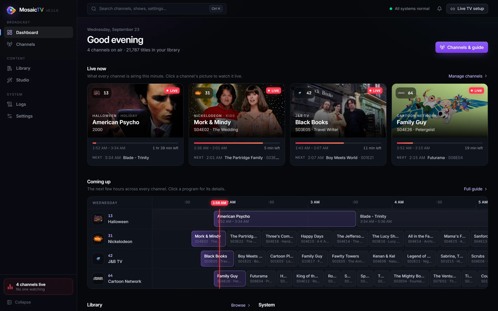
</p>

---

Remember channel surfing? MosaicTV brings it back, but every channel is built
from *your* library. Set up a Saturday-morning cartoons block, a 24/7 sitcom
rotation, a late-night movie channel — then flip to it like real TV: it's
already playing, mid-episode, right on schedule.

Inspired by [ErsatzTV](https://ersatztv.org/), rebuilt from scratch to be
simple to run and pleasant to configure.

## At a glance

- 📺 **Real live-TV channels** — tune in mid-program like broadcast TV; every channel resumes where it left off, forever.
- 🗓 **Scheduling that thinks like a station** — a 24/7 rotation plus day/time blocks with soft or exact-time starts, and five playback orders.
- 🧩 **Multi-segment episodes, aired as broadcast** — cartoons split into 7-minute shorts play as the half-hour episodes they aired as, even with a short borrowed from another show.
- 🎬 **Broadcast polish** — station logos and watermarks, generated station-ID filler, and burned-in "coming up next" captions.
- 🔍 **A library built in** — scanner, TMDB artwork and metadata, show pages and a searchable poster wall.
- 📡 **Works with what you watch on** — M3U + XMLTV for Jellyfin, Emby, VLC, TiviMate and any IPTV app, and a built-in HDHomeRun tuner for Plex (no Threadfin needed).
- ⚡ **GPU encoding** — NVIDIA, Intel QuickSync, VAAPI, AMD AMF or Apple VideoToolbox, verified on your host, with a clean CPU fallback.
- 📦 **One container** — web UI, database and ffmpeg included. Runs on Unraid, any Docker host, or a NAS.

## Features

### A control room, not a config file

The dashboard shows every channel live over the artwork of what it's airing,
with a progress bar, time left and what's next — click a picture to watch it in
the browser. The **Channels** page puts your channels four to a row with the
full **TV guide** underneath: a pinned time ruler, a red now-line, 12/24/48-hour
spans and three zoom levels. Click any program for its details.

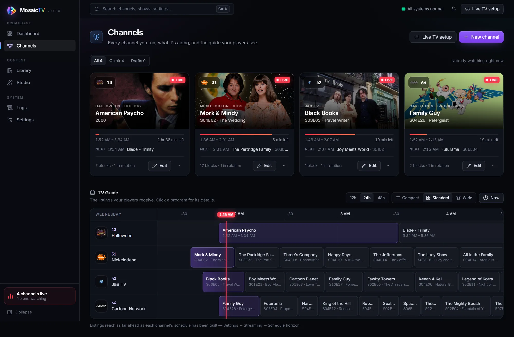

### Channels built from collections

A channel plays **collections** — the programming units you build from whole
shows, single seasons, individual episodes and movies, plus an optional smart
filter (by library, type, title or genre). Members show as a poster grid you
drag into order, with each show's seasons and episode count at a glance.

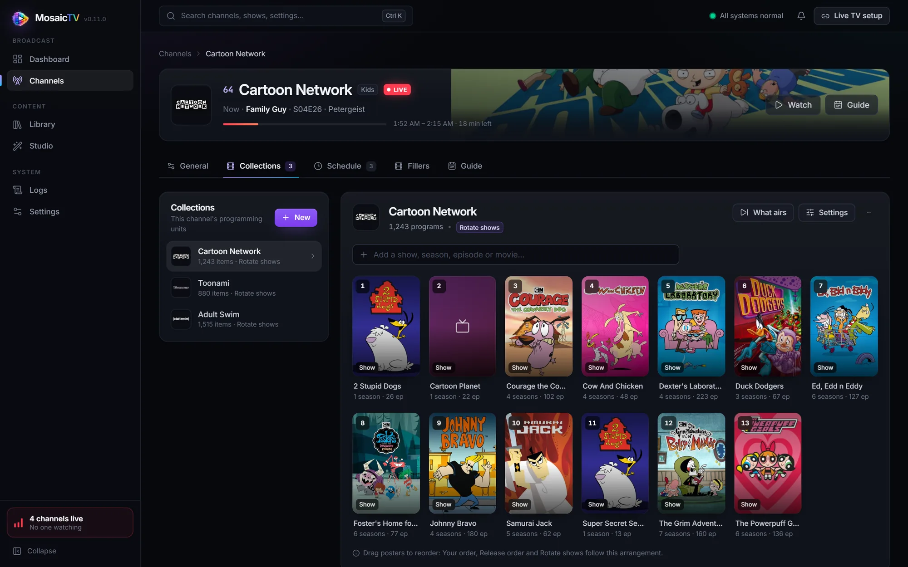

### Multi-segment episodes, aired the way they were broadcast

A lot of classic cartoons were made as shorts. A half-hour of *Dexter's
Laboratory* is three seven-minute segments, and *2 Stupid Dogs* ran a *Super
Secret Secret Squirrel* short between its two dog cartoons. Your files store
each segment as its own episode, so most tools air them as separate programs,
shuffle them apart and fill the guide with seven-minute slivers.

MosaicTV puts them back together. On any season, **Group broadcast episodes**
folds the segments that aired together into one **broadcast episode**. The
segments play back-to-back as a single program and show as one entry in the
guide. Every playback order and every "play N" turn treats the episode as one
program, and a block's end or a hard start never splits it. A grouped episode
never re-airs as loose parts.

- **Suggest groupings** packs consecutive segments into 11-, 22- or 30-minute
  slots (or a length you choose) as a starting point. Tick, group, reorder or
  ungroup from there.
- **Borrow a segment from another show.** Search the whole library and slot a
  short from a different series into the running order, right where it aired.
  That show's own page then marks which of its episodes air inside another.
- **Nothing on disk changes.** Grouping is metadata only: your files keep their
  names and their real season and episode numbers.

The full walkthrough is in
[Channels & Scheduling](docs/channels.md#broadcast-episodes-multi-segment-shows).

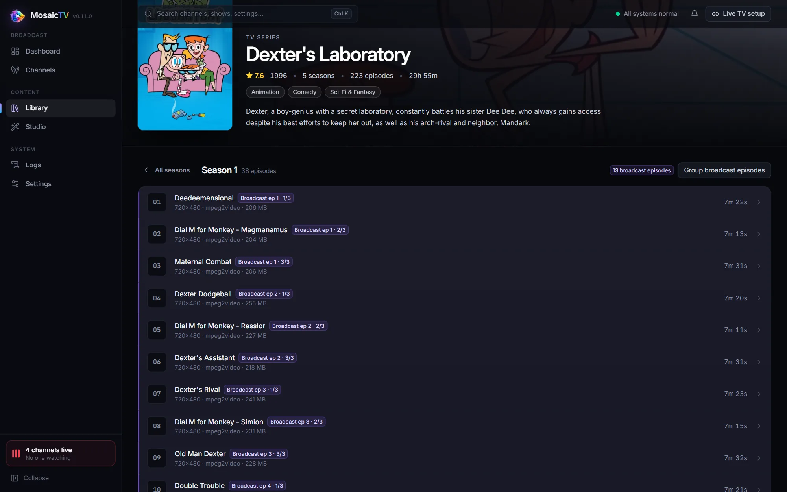

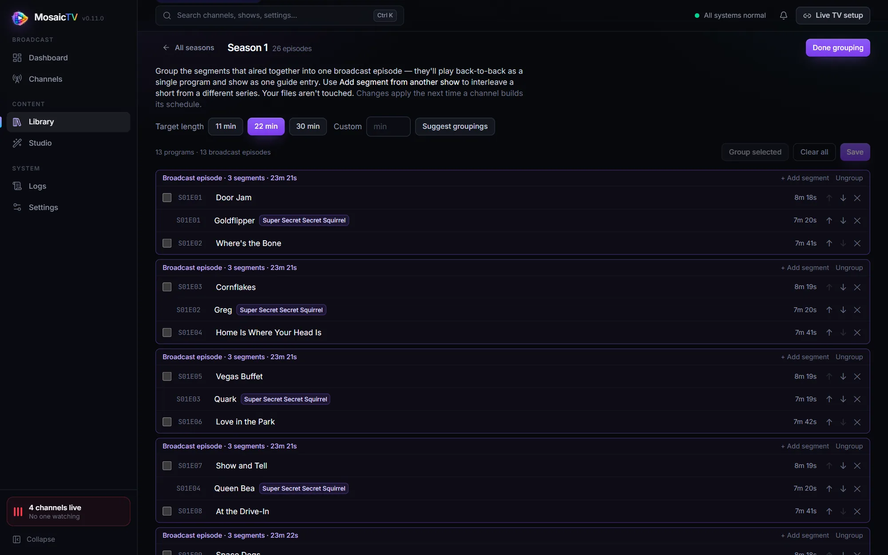

### Five playback orders, explained as you pick

Every collection plays in one of five orders, each described in plain words
with a live preview of its first airings:

| Order | What it airs |
| ----- | ------------ |
| **Your order** | Exactly as arranged — each show's full run before the next one. |
| **Release order** | Oldest first: movies by year, each show's episodes in order. |
| **Rotate shows** | One episode from each show in turn, in your order. |
| **Rotate shows, mixed** | Every show gets one episode per round, each round in a new random order. |
| **Shuffle** | Everything at random, nothing repeating until all of it has played. |

In a rotation **each show keeps its own place**: add a show and it starts at
episode 1 while the rest carry on; reorder them and only whose turn is next
changes.

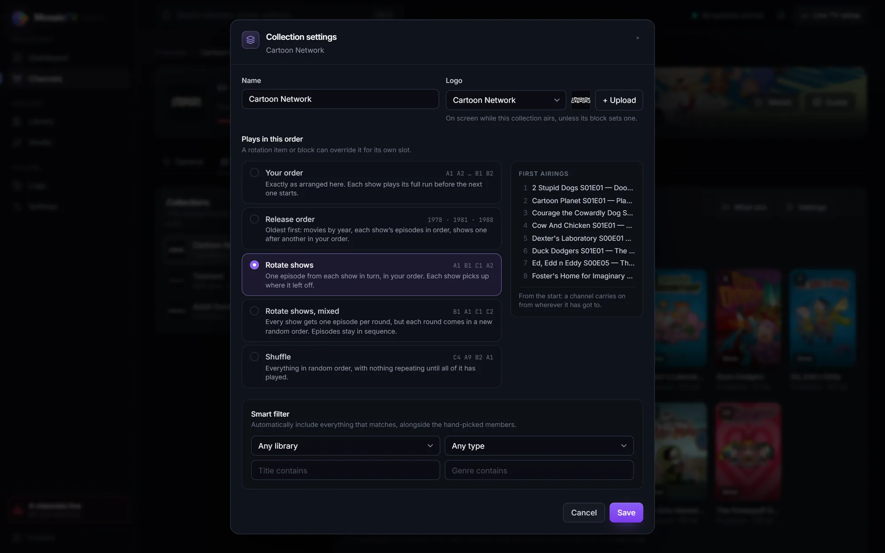

### A schedule that runs like a station

The **rotation** is the channel's 24/7 backbone — collections that loop
forever, 1 or N programs a turn. **Time blocks** override it for specific days
and times (*Weekdays 6–9pm → Cartoons*), shown on a weekly grid. A **soft**
start waits for the current program to finish; a **hard** start begins on the
dot, with filler covering the gap. Each block can carry its own playback order,
logo, filler and captions. Guides are built ahead to your chosen horizon and
topped up automatically, so listings never run dry.

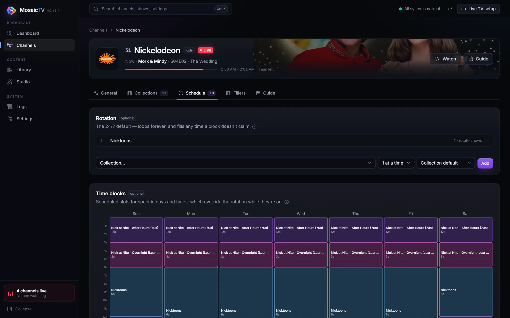

### Your library, with artwork

A Plex-style scanner indexes TV, movies and music videos (incremental,
ffprobe-backed), and pulls posters, backdrops, descriptions and ratings from
TMDB — or uses the artwork already beside your files. Browse each library as a
poster wall with search and sort, open a show on its backdrop, and fetch or
re-match metadata per library from Settings. Thumbnails are sized to the tile
and cached, so big libraries stay quick to browse.

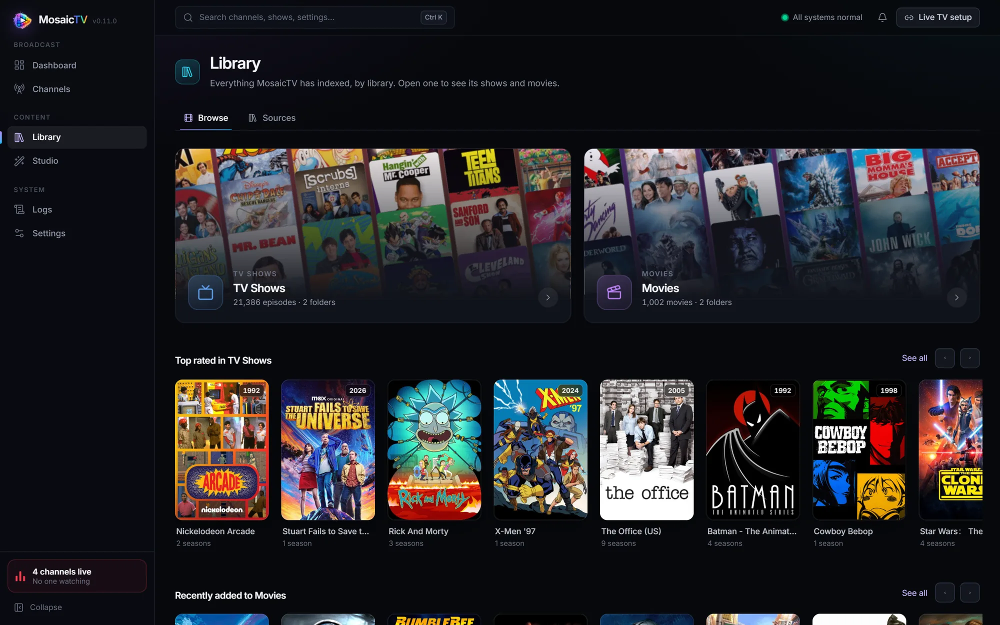

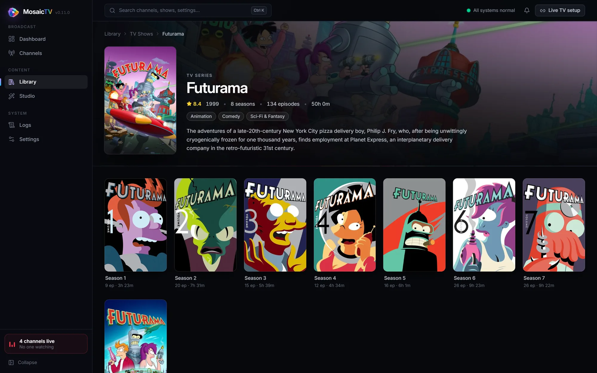

### Studio: logos, watermarks and station IDs

**Studio** is the branding suite. Upload logos and give each its own
**watermark** — permanent or intermittent with fades, any corner, size and
opacity — previewed live over a frame from your library in 16:9 or 4:3.

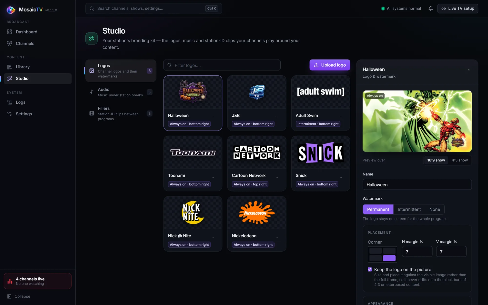

**Station-ID filler** covers the gaps so blocks end on time: upload your own
bumpers and idents, or generate one branded with the channel's logo. The
**Frosted glass** ident scrolls rows of logos behind frosted glass with
out-of-focus lights drifting at different depths, a light glint across the
surface, and your logo floating in front. Add a music bed, match the clip to
the track's length, preview a still (click it to enlarge), and assign fillers
per channel or per block.

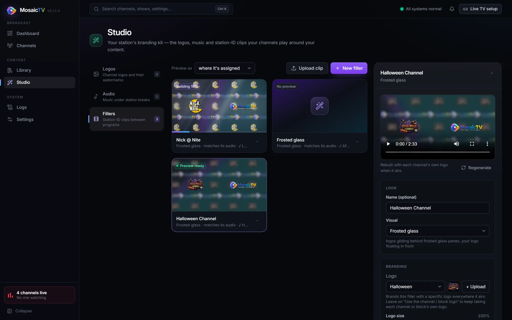

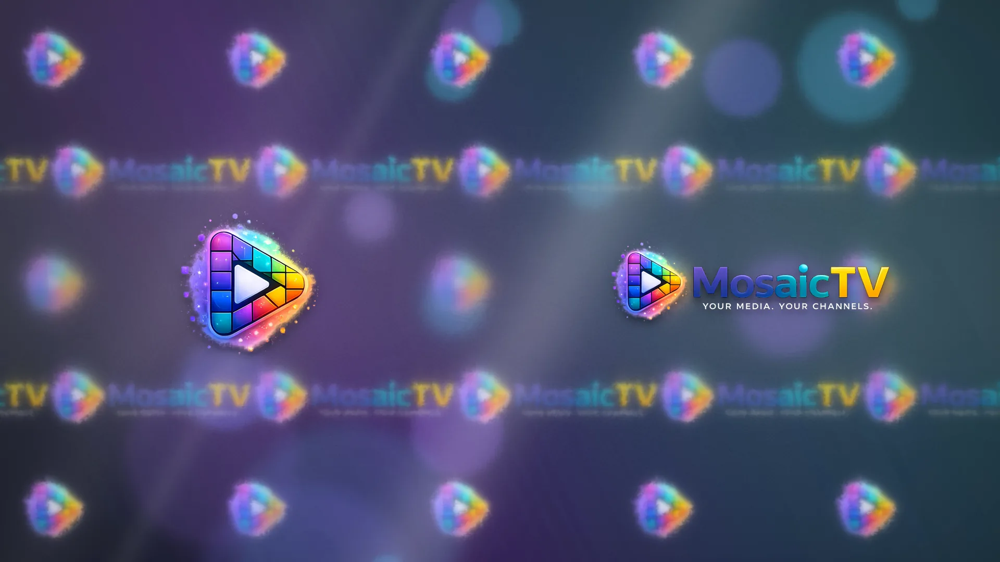

### "Coming up next" and the default watermark

Burn a caption into the last stretch of a program naming what's next — per
channel or per block, from a simple template. The default watermark (for logos
without settings of their own) has the same live preview.

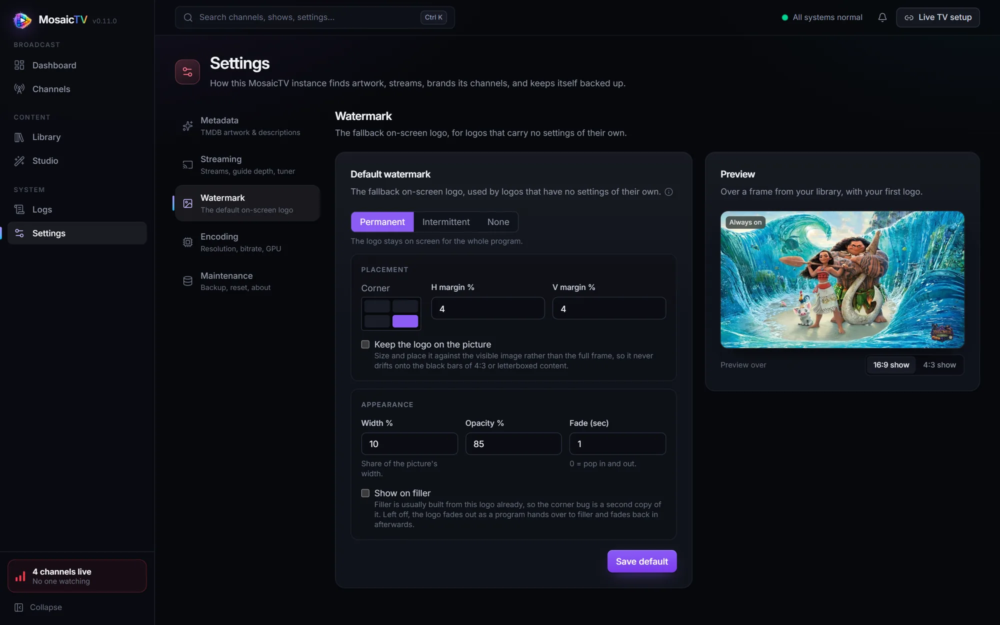

### Search, notifications and casting

- **Search from anywhere** (Ctrl/⌘ K) — pages, channels, settings, and every
  show and movie in your library.
- **Notifications** — a bell in the top bar follows filler generation, library
  scans and metadata fetches with live progress, and tells you when each
  finishes, wherever you are in the app.
- **Watch and cast** — any channel's live preview plays in the browser and can
  be sent to a Chromecast or Google TV (Chrome/Edge, over HTTPS) or an Apple TV
  (Safari, AirPlay).

<table>
  <tr>
    <td width="50%">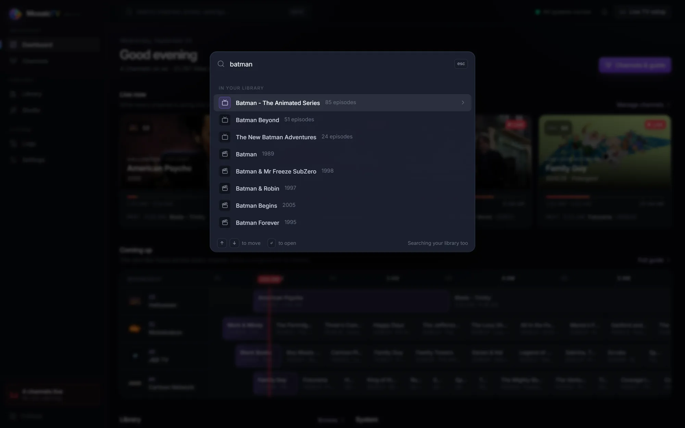</td>
    <td width="50%">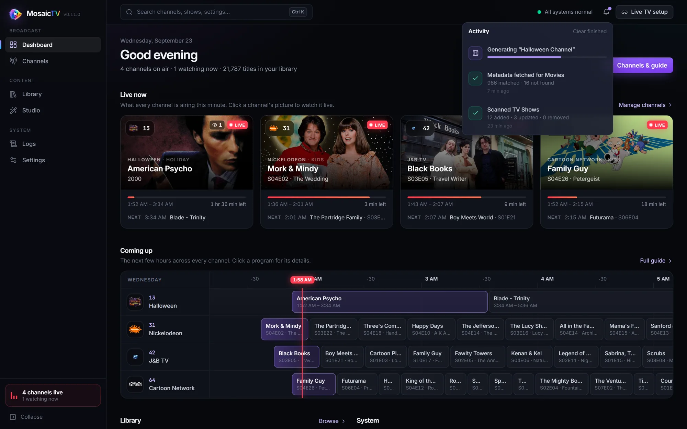</td>
  </tr>
</table>

### Works on a phone, and on a 4K monitor

The whole interface is responsive — from a phone (the sidebar becomes a
drawer) to a laptop to a 1440p or 4K monitor, which gets wider pages and more
columns rather than a narrow strip.

<p align="center">
  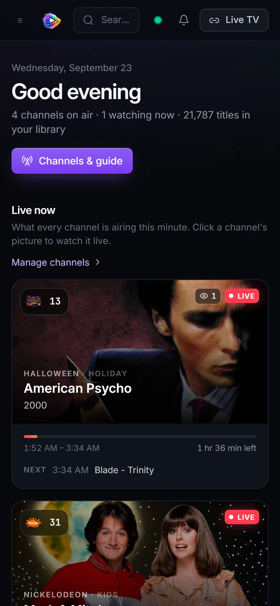
  &nbsp;&nbsp;
  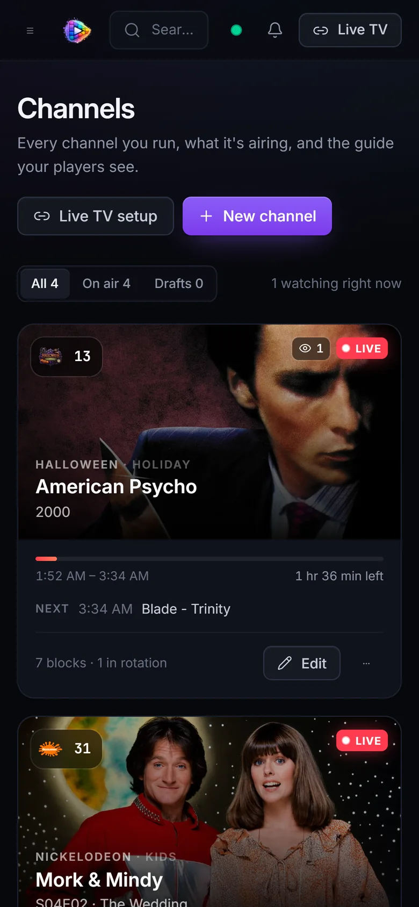
</p>

### Output and encoding

- **Standard M3U + XMLTV**, plus a built-in **HDHomeRun tuner** that Plex's
  Live TV adds directly. **Live TV setup** in the top bar has every address
  with copy buttons and step-by-step instructions per player.
- **Shared HLS** (one transcode per channel, however many viewers) or
  per-client **MPEG-TS**.
- **Per-channel encoding profiles** — resolution, fps, bitrate, deinterlacing,
  subtitle burn-in and loudness normalization — and a preferred audio
  language per channel.
- **GPU encoding** on NVIDIA, Intel QuickSync, VAAPI, AMD AMF or Apple
  VideoToolbox, each verified by a real test encode on your host.
- **One-click backup** from Settings (restoring is a file copy — see
  [Troubleshooting](docs/troubleshooting.md)), and an in-app log viewer with a
  download for bug reports.

## Quick start

```bash
docker run -d \
  --name mosaictv \
  --restart unless-stopped \
  -p 8688:8688 \
  -e TZ=America/Chicago \
  -v /path/to/appdata/mosaictv:/app/data \
  -v /path/to/your/media:/media:ro \
  ghcr.io/tronvondoom/mosaictv:latest
```

Open `http://YOUR-SERVER:8688`, add a library, scan, build a channel — the
[Getting Started guide](docs/getting-started.md) walks you through all of it
in about ten minutes.

> ⚠️ MosaicTV has no login — keep it on your LAN (or behind a VPN like
> Tailscale). See [Security](docs/security.md).

## Documentation

| | |
| - | - |
| 🚀 [Installation](docs/install.md) | Docker run · Portainer · **Unraid template** · Compose |
| 🏁 [Getting Started](docs/getting-started.md) | First library → first channel → first stream |
| 🗓 [Channels & Scheduling](docs/channels.md) | Collections, multi-segment broadcast episodes, rotations, time blocks, playback orders, the guide |
| 🎨 [Branding](docs/branding.md) | Logos, watermarks, filler styles, up-next captions |
| 📡 [Connecting Players](docs/clients.md) | Jellyfin · Emby · Plex · VLC · IPTV apps · casting |
| ⚡ [Hardware Acceleration](docs/hardware-acceleration.md) | CPU vs NVIDIA, setup per platform, profiles |
| 🔒 [Security](docs/security.md) | LAN-only stance, VPN access, reverse proxies |
| 🛠 [Troubleshooting & Backup](docs/troubleshooting.md) | Common fixes, logs, backup/restore |

## Tech stack

Express + TypeScript backend, React + Vite + Tailwind frontend, Prisma +
SQLite, ffmpeg for everything video. See [CHANGELOG.md](CHANGELOG.md) for
release history.

For local development:

```bash
npm run install:all   # root + server + web dependencies
npm run dev           # backend :8688, frontend :5173
```

## Contributing

Issues and PRs welcome — bug reports with the in-app log download attached are
extra welcome. If you're missing a feature (another filler style? another
metadata source?), open an issue and let's talk.

## License

[GPL-3.0](LICENSE) — free to use, modify, and share; derivatives stay open.
